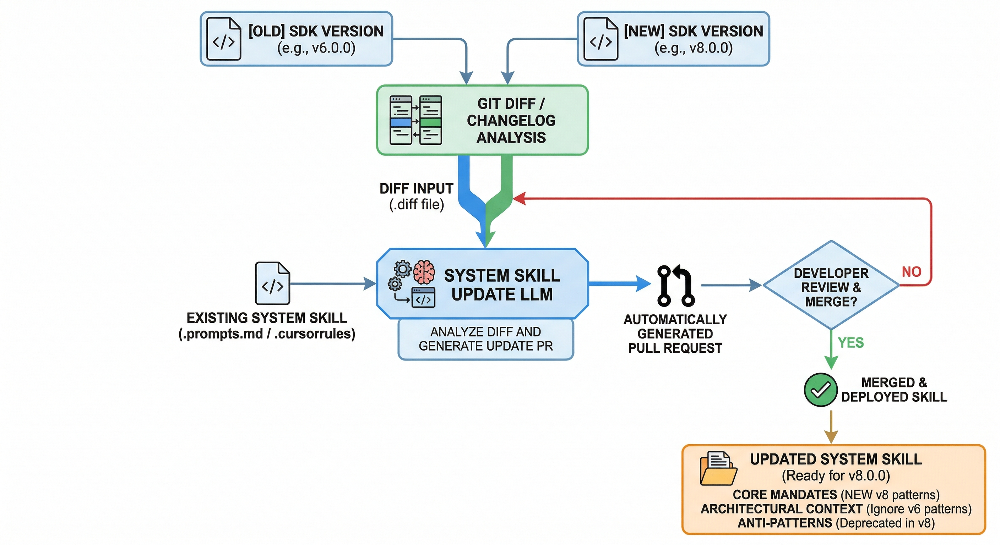

As any software engineer who has tried to build a reliable tool on top of an LLM knows, natural language is inherently messy. A prompt that works perfectly on Monday might produce a hallucinated mess on Tuesday. To build robust AI integrations, we need to stop treating them like casual chatbots and start leveraging the current state of the art in interacting with them. The world of LLMs is pivoting towards skills, to cover this gap.

#### The Evolution of Prompting

When you first interact with an AI, you use what we could call "casual prompting" or *Zero-shot* prompting. You ask a question, and if the answer isn't quite right, you refine it. 

*   "Write a function to parse a JSON file."
*   "No, make it in Kotlin."
*   "Actually, use the standard library only."

This iterative process is fine for daily tasks, but it falls short for automation. When you are building a tool that leverages an LLM, like a CLI tool that can autonomously manage your workspace, modify your codebase, or orchestrate workflows, you cannot rely on trial and error.

#### Current State of the Art: The Rise of SDK-Provided AI Guides

We are no longer relying on generic prompting techniques. The current state of the art involves library authors and platforms directly providing "Skills" or "Prompt Guides" to ensure AIs interact with their tools correctly.

When an LLM writes code for a fast-moving SDK, it often hallucinates deprecated APIs or completely invents non-existent classes based on outdated training data. To combat this, companies have started publishing official AI guidelines, essentially rulebooks intended for machines rather than humans.

We can see this emerging pattern across the industry:
*   **RevenueCat** provides a dedicated [AI Prompt guide](https://www.revenuecat.com/docs/welcome/overview) designed to be fed into developer assistants, ensuring the AI understands their latest SDK patterns and billing logic.
*   **OneSignal** maintains a public repository of [SDK AI Prompts](https://github.com/OneSignal/sdk-ai-prompts/), giving developers pre-packaged instructions to constrain how an LLM implements push notifications in their apps.

These aren't tutorials for humans; they are `.cursorrules`, `prompts.md`, or system instructions designed to anchor an LLM to reality.

One very immediate advantage when working with skills is the fact that Skills can prevent, or mitigate, hallucinations. One of the most common issues while integrating an SDK using an LLM is that the information is often outdated, based on the cutoff date of the LLM. For instance, the LLM might only have been trained on the version 6.0.0 of an SDK. Meanwhile, the new version 8.0.0 contain a few breaking changes, new APIs, or even a total redo of the library.

Updating this manually requires of course some time investment, but of course, LLMs can be used to improve and optimise the flow. An LLM could analzse the .diff between two releases, and make a Pull Request to update automatically the skill based on the new APIs, features or interfaces.

#### Engineering System Skills

This shift gives birth to a new engineering discipline: writing "Skills". A skill is essentially a compartmentalized set of rules and context injected into an AI agent's system prompt before it attempts a task. 

Instead of a generic chat prompt, you provide a highly structured document. Think of it as an API contract, but written in Markdown instead of OpenAPI.

A well-engineered skill usually contains a few critical components:

1.  **Core Mandates:** These are the absolute, unbreakable rules. "Always use the v6 SDK initialization," or "Do not assume a library is installed without checking `build.gradle`." You write these not as suggestions, but as existential directives. 
2.  **Architectural Context:** AIs are eager to please, which means they will often guess if they lack information. A good skill defines the correct, modern approach. It explicitly instructs the model to ignore outdated stack overflow answers and strictly use the patterns defined in the guide.
3.  **Anti-Patterns:** Just as important as what to do is what *not* to do. SDK prompt guides explicitly list deprecated methods and common AI hallucinations to proactively prevent the model from falling into known traps.

Writing these guidelines is a exercise in psychology. You are not writing for a human who can read between the lines, neither are you writing for a compiler that will throw a syntax error. You are writing for an alien intelligence that is incredibly smart but dangerously literal. 

You must anticipate edge cases, not with `try/catch` blocks, but with unambiguous constraints. For instance, if you want an AI to search for emails using a tool, you don't say, "Find recent emails." You say, "When requested to find emails, mandate the use of the search syntax and limit the initial query to the top 10 results to preserve context."

#### Conclusions

*   Casual prompting is for brainstorming; structured, platform-provided skills and AI guidelines are for production.
*   Treat your AI system prompts as production code. Structure them, version-control them, and treat them as a first-class citizen of your repository.
*   If you are a library author, consider providing an AI Prompt Guide or a `.cursorrules` file. Developers will use LLMs to implement your SDK anyway; you might as well give the LLM the correct map.
*   We have already moved from a world where we solely write logic to a world where we also write constraints and define rules for language models. Embrace the shift.

Orchestrating these agents is no longer a distant concept; it is our present reality.

I write my thoughts about Software Engineering and life in general on my [Mastodon account](https://kotlin.social/@eenriquelopez). If you have liked this article or if it did help you, feel free to share, 👏 it and/or leave a comment. This is the currency that fuels amateur writers.