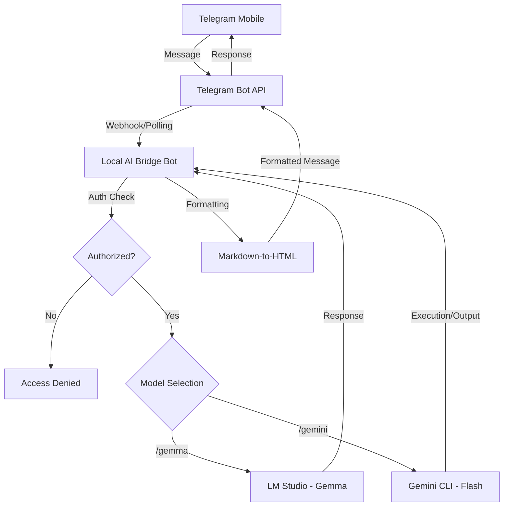
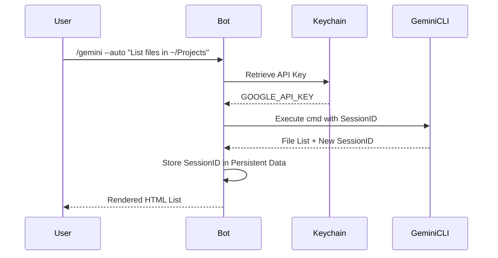

As software engineers, our productivity is often tethered to the terminal. We’ve grown accustomed to the lightning-fast feedback loops of local development, and more recently, the transformative power of LLMs integrated directly into our CLI workflows. However, there is a recurring friction point: the moment we step away from our desks, that power vanishes. We are left with mobile apps that, while capable, often lack the context of our local environments, our specific codebase, or the specialized tools we’ve spent years refining.

I recently set out to solve this by building the **Local AI Bridge**. The goal wasn’t just to create another chatbot, but to build a production-grade interface that acts as a secure, persistent umbilical cord between my mobile device (via Telegram) and the dual-engine intelligence of local models (Gemma) and cloud-orchestrated CLI tools (Gemini Flash).

#### The Architectural Vision: A Hybrid Intelligence

The fundamental challenge in building an AI bridge is balancing the trade-offs between local and cloud processing. Local models like Gemma, running via LM Studio, offer unparalleled privacy and zero latency for sensitive data. Cloud models like Gemini Flash, accessed through the Gemini CLI, provide the "heavy lifting" needed for complex orchestration and filesystem analysis. 

The Local AI Bridge serves as the traffic controller for these two engines. Instead of a stateless "ping-pong" interaction, the bot manages a sophisticated state machine. When a message arrives via Telegram, the bot identifies the intended recipient—be it the local inference engine or the cloud-based CLI—and ensures that the relevant context is injected before the message is processed.

#### Solving the Statelessness Problem

One of the most frustrating aspects of standard AI integrations is their inherent "forgetfulness." If you ask a question about a function and then ask for a refactoring suggestion, the AI should know exactly what code you’re talking about. In the Local AI Bridge, I implemented two distinct strategies for persistence.

For the local Gemma engine, I utilized a sliding window of conversation history. Using the `PicklePersistence` layer within the Telegram library, the bot stores the last twenty turns of dialogue. This history is meticulously sanitized and injected into the system prompt with every new query, ensuring that Gemma remains "anchored" to the current conversation.

For the Gemini CLI, the approach is even more technical. The Gemini CLI natively supports session management through a session ID. By capturing the session ID from the CLI's JSON output and storing it in the bot's user data, I can resume a session across different Telegram messages. This allows for complex, multi-step workflows where Gemini can "remember" the output of a previous shell command or a file search, enabling a true interactive terminal experience on mobile.

#### The Security Perimeter: Keychain vs. Dotenv

In an era of frequent credential leaks, storing API tokens and authorized user IDs in a `.env` file is a risk I wasn't willing to take. The Local AI Bridge treats security as a first-class citizen. I integrated the `keyring` library to move all sensitive configuration into the macOS Keychain. 

This architectural choice means that even if my machine is compromised and the source code is accessed, the critical tokens for Telegram and Gemini remain encrypted within the operating system's secure vault. The bot only retrieves these credentials at runtime. Furthermore, access is restricted not just by Telegram’s numeric user ID, but also by a secondary username check, providing a two-factor-like authorization layer for any incoming request.

#### Engineering the User Experience: Beyond Raw Text

A major pain point with Telegram bots is the rendering of complex AI output. LLMs are notoriously verbose with Markdown, and Telegram’s HTML parser is unforgiving. To solve this, I developed a custom `md_to_html` converter. It doesn't just swap tags; it uses a multi-pass regex engine to protect code blocks from being mangled by other formatting rules, converts headers into bold text for better mobile readability, and handles nested lists that would otherwise break the Telegram API's strict parsing.

The `/set <model>` command adds another layer of polish. By allowing the user to set a "preferred" model, the bot removes the need to prefix every message with a command. This transforms the interaction from a series of commands into a natural conversation, where the bot intelligently routes your text to the AI you use most frequently.

#### The "Auto" Mode: Autonomy with a Safety Net

Perhaps the most powerful—and dangerous—feature is the `--auto` mode for the Gemini CLI. This allows the AI to autonomously decide to execute shell commands. To make this viable for mobile use, I implemented a sanitized environment. The bot executes Gemini in a restricted subprocess with a clean `PATH` and limited environment variables, preventing the AI from accidentally leaking host-level information. This gives me the ability to check server logs, run build scripts, or even push small git commits while on the go, all through a secure chat interface.

#### Final Thoughts on the Future of Local-Cloud Hybridity

Building the Local AI Bridge has reinforced my belief that the future of software engineering isn't purely in the cloud or purely local. It’s in the orchestration between the two. By leveraging the privacy of Gemma and the power of Gemini Flash, and wrapping them in a secure, mobile-first interface, we can reclaim our productivity without being chained to our desks.

We have moved past the point where AI is a novelty. It is now a primary tool in our arsenal, and as with any tool, the interface matters. By owning the bridge, we own the workflow.

If you’re interested in exploring the code or setting up your own bridge, I’ve made the repository public on my [GitHub](https://github.com/kikoso/local-ai-telegram-bridge). 

I write my thoughts about Software Engineering and life in general on my [Mastodon account](https://kotlin.social/@eenriquelopez). If you have liked this article or if it did help you, feel free to share, 👏 it and/or leave a comment. This is the currency that fuels amateur writers.
